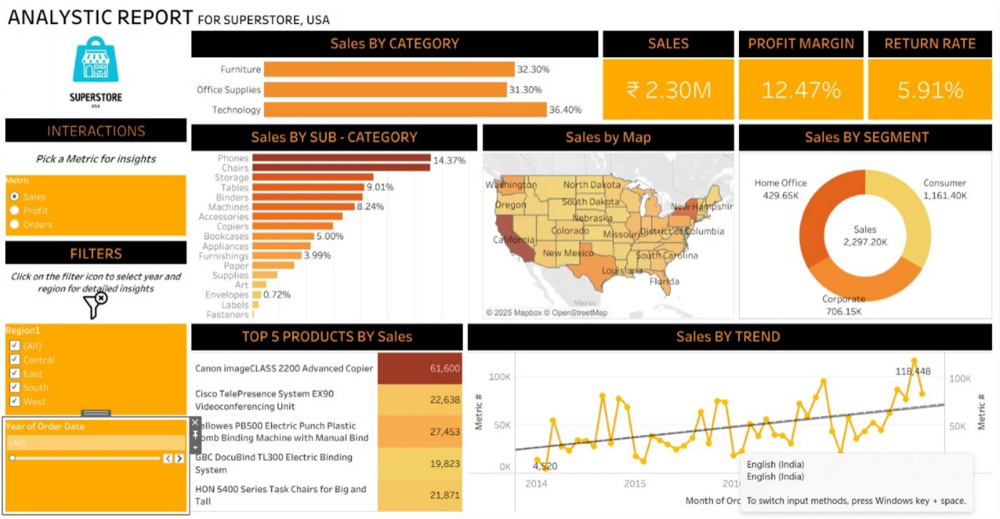

---

# 📊 Tableau Assignment Dashboard

This repository contains the **Tableau Assignment Dashboard**, a packaged Tableau workbook (`.twbx`) designed to provide clear, interactive insights into the dataset used in the assignment. It offers a visually rich overview of key performance indicators, trends, and comparative metrics.

---

## 🚀 Overview

The dashboard helps users quickly analyze and interpret data through intuitive visualizations. It is suitable for exploratory analysis, reporting, and performance monitoring.

Key objectives of the dashboard:

* Provide a consolidated view of essential metrics
* Enable interactive filtering and drill-downs
* Present trends and comparisons in a clear visual format
* Support data-driven decision making

---

## 🧩 Features

### **✔ Interactive Filters**

Filter the dashboard by key dimensions such as category, region, or time period to explore data from different angles.

### **✔ KPI Summary**

Top-level metrics give a snapshot of performance at a glance.

### **✔ Trend Visualizations**

Line charts reveal changes and patterns over time.

### **✔ Comparative Analysis**

Bar and pie charts provide comparisons across categories, segments, or groups.

### **✔ Detailed Tooltips**

Hovering over elements reveals deeper insights and additional metrics.

---

## 📁 File Included

* **`tableau_assignment_dashboard.twbx`**
  A Tableau Packaged Workbook containing:

  * The dashboard
  * Data extracts (if included)
  * Visual assets

This file can be opened directly in **Tableau Desktop**.

---

## 🛠 How to Use

1. Download the `.twbx` file from this repository
2. Open it in **Tableau Desktop** (any recent version)
3. Interact with filters and charts to explore insights
4. Modify or extend the dashboard if needed

---

## 📸 Screenshot (Optional)

If you upload a screenshot, I can add it here:

```md



```

---

## 📚 About

This dashboard was created as part of a Tableau data visualization assignment.
It demonstrates skills in:

* Data cleaning and structuring
* Dashboard design principles
* Visual storytelling
* Interactive analytics

---

If you'd like, I can also:

✅ Add badges (e.g., Tableau, GitHub Actions)
✅ Add a project structure diagram
✅ Improve the description based on your dashboard screenshot

Just upload the screenshot or tell me!
